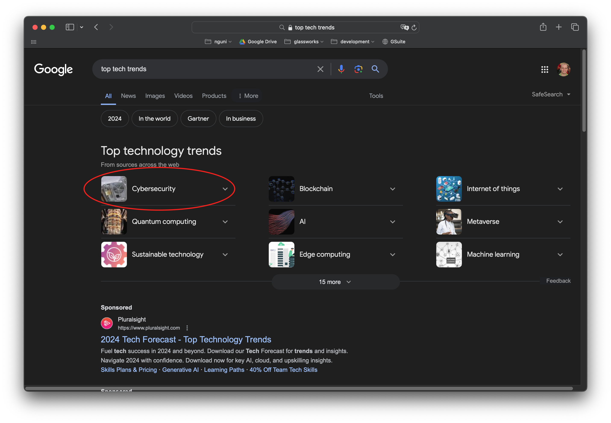

# Introduction

La cybersécurité est devenue une question centrale dans le domaine de la technologie.

La prolifération d'acteurs malveillants, de pirates informatiques et de cybercriminels a obligé le monde des technologies de l'information à réfléchir à ses pratiques et à accorder plus d'attention à la protection de ses systèmes, de ses plateformes et de ses données.

Mais pourquoi ?

**La valeur intrinsèque des "données"**

... a explosé au cours de la dernière décennie, les rendant de plus en plus précieuses pour nous, et donc pour les criminels.

Le vol de données peut avoir de multiples motivations :

- Vos données ont une valeur financière (secrets commerciaux, coordonnées bancaires, ...)
- Vos données peuvent être exploitées pour le compte de tiers (vente de vos données à des annonceurs).

- Vos données peuvent faire l'objet d'une demande de rançon :
  - Vos données peuvent causer des préjudices : handicap, race lors de l'embauche
  - Vos données sont embarrassantes ou peuvent entraîner un isolement social si elles sont divulguées (orientation sexuelle, religion, affiliation politique).
  - Vos données sont essentielles au fonctionnement de votre service.

- Mais parfois, ce ne sont pas nécessairement les criminels qui utilisent les données de mauvaise foi. Les entreprises collectent également des données qui ne les concernent pas et les vendent à des tiers.

**L'adoption de la technologie dans tous les aspects de notre vie**

... nous ouvre à tous les risques qui y sont associés.

Une interruption de service peut entraîner :

- une perte financière
- une perte personnelle
- l'arrêt d'un traitement médical
- des fusions nucléaires
- ...

Mais c'est aussi un cercle vicieux. Plus la technologie est utilisée dans nos vies, plus nous divulguons de données et plus ces données ont de la valeur.

## La réponse législative

Compte tenu de la valeur croissante des données et des risques de plus en plus importants liés à la protection des données, les gouvernements sont contraints de réagir.

**RGPD** (Europe)

Le sigle RGPD signifie " Règlement Général sur la Protection des Données " (en anglais " General Data Protection Regulation " ou GDPR). Le RGPD encadre le traitement des données personnelles sur le territoire de l'Union européenne.

[https://www.cnil.fr/fr/rgpd-de-quoi-parle-t-on](https://www.cnil.fr/fr/rgpd-de-quoi-parle-t-on)

**CNIL** (France)

Organisme chargé de faire respecter la protection des données en France, notamment le RGPD.

**HDS** (France)

Protection des données médicales.


Le problème de la réponse législative est qu'elle est **toujours en retard** par rapport aux tendances actuelles. La technologie évolue rapidement, mais la politique avance à pas de tortue. 

De plus, le langage législatif peut être difficile à comprendre et à interpréter. Il faut de vastes ressources pour suivre un problème, ce qui implique de longues procédures judiciaires.


## La réponse de l'industrie

L'industrie a également créé un ensemble de normes qui prescrivent la gouvernance de la sécurité, la plus notable étant la norme ISO 27001.

[ISO-27001](https://www.france-certification.com/securite-de-linformation-donnees/iso-27001/?gad_source=1&gclid=Cj0KCQjwxeyxBhC7ARIsAC7dS39n4XO4SOSiEzBOGw5CYjaR5MaX5BTd5_7PhCrA2Mc5DeNfQp6P2DgaAlG7EALw_wcB)


Le problème des normes industrielles est qu'elles sont souvent **volontaires**, ce qui signifie que vous pouvez mettre en œuvre une partie ou la totalité d'une norme comme vous le souhaitez.

La certification d'une norme peut devenir une condition préalable à la collaboration (dans le cadre d'un appel d'offres, par exemple). Toutefois, cette démarche peut être longue, coûteuse et hors de portée des start-ups et des petites entreprises.

Certains prétendent que cela peut être très étouffant pour l'innovation.


Exemple, chez Microsoft (2024)...

[Chez Microsoft](https://microsoft.developpez.com/actu/357361/Microsoft-annonce-que-la-securite-informatique-devient-un-critere-de-remuneration-de-ses-cadres-suite-a-des-failles-de-securite-jugees-evitables-et-une-communication-estimee-insuffisante/)

## La réponse technologique

En tant que futur directeur technique, vous devrez tenir compte des exigences législatives et des normes industrielles.

Mais vous devrez aussi relever des défis qui évoluent rapidement. 

Les pirates informatiques ont toujours **une longueur d'avance**. Les bogues, les faiblesses ou les vecteurs d'attaque sont souvent signalés des jours, des mois, voire des années après leur découverte par des acteurs malveillants.

## L'argument économique

Soyons réalistes, pour le commun des mortels, la sécurité est un casse-tête. L'authentification à deux facteurs ? Se souvenir d'un mot de passe ? 

Nous pouvons nous amuser à installer les infrastructures de sécurité les plus récentes et les plus modernes qui **coûtent une fortune**, mais cela n'en vaut la peine que si les données ou les systèmes que nous protégeons ont **une valeur équivalente**.

