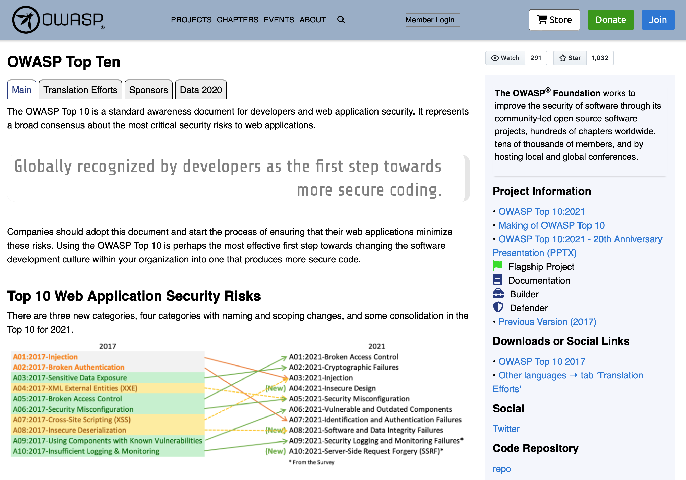
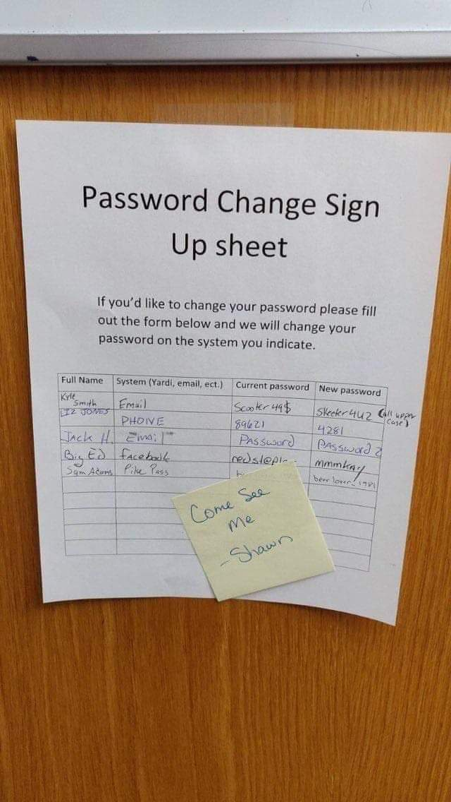
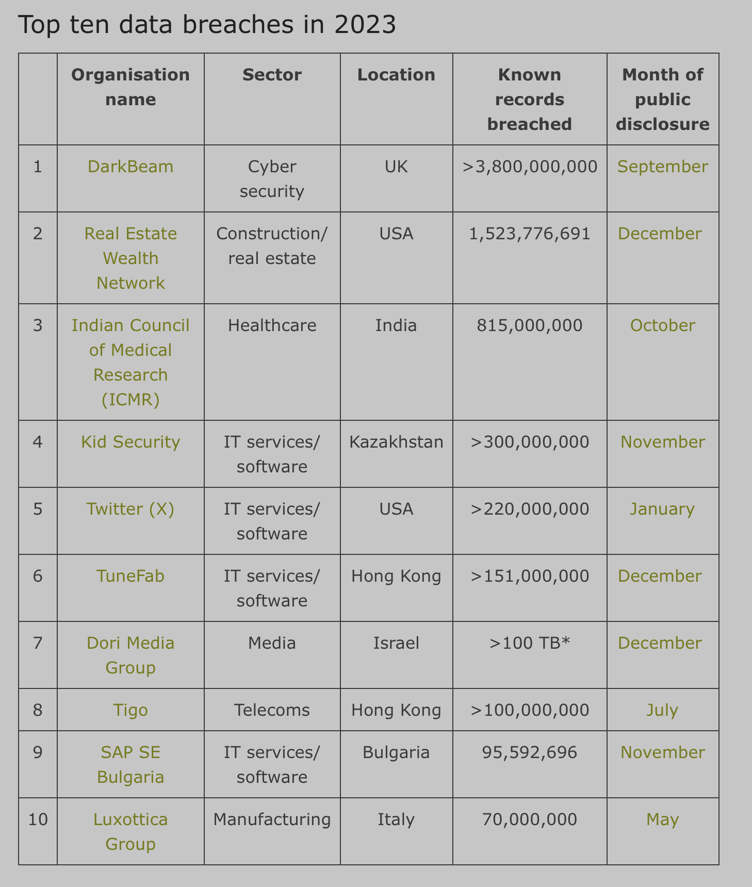

# Types d'attaques

La première étape d'une initiation à la cybersécurité consiste à connaître les différents types de risques, notamment les vecteurs d'attaque utilisés aujourd'hui. [Le site web de l'OWASP](https://owasp.org/www-project-top-ten/), par exemple, dresse la liste des cybermenaces les plus courantes :

## Vecteurs d'attaque

Il existe de nombreux types d'attaques. Les connaissez-vous tous ? Pouvez-vous élaborer une stratégie pour réduire ces risques ?

Risques liés aux machines et aux systèmes d'exploitation :

* virus
* cheval de Troie
* rootkit
* ransomware
* ...

Risques liés au réseau et à la communication :

* "man-in-the-middle" et "replay"
* _packet-sniffing_ (reniflage)
* _port-scanning_ (balayage de port)
* DDoS
* ...

Attaques au niveau des services :

* failles d'injection
* _zero-day bugs_ bogues du jour zéro
* ...

Attaques par Internet :

* bogues d'identification et d'autorisation
* XSS
* CSRF
* _click-jacking_ (détournement de clics)
* ...

Attaques humaines :

* _phishing_ (hameçonnage)
* stockage / communication / oubli des mots de passes
* ...

<figure><figcaption>
Phishing "old-school" ?
</figcaption></figure>

## Examples

### TunnelVision (2024)

> Le trafic de la victime est maintenant démasqué et acheminé directement par l’attaquant. L’attaquant peut lire, supprimer ou modifier le trafic qui fuite, et la victime maintient sa connexion à la fois au VPN et à Internet »


TunnelVision


[TunnelVision](https://securite.developpez.com/actu/357446/Securite-en-ligne-compromise-une-attaque-inedite-menace-la-securite-de-presque-toutes-les-applications-VPN-et-remet-en-question-leur-utilite-fondamentale/)

### MoveIT (2023)

> Les failles en question avaient été découvertes à quelques jours d’intervalle, dans MOVEit Transfer, logiciel de transfert sécurisé de fichiers. L’une et l’autre ouvraient la voie à des injections SQL au niveau du front-end web. Avec, entre autres conséquences potentielles, l’exfiltration de données.

[MoveIT / Pole Emploi](https://www.silicon.fr/majorel-cl0p-moveit-fuite-donnees-pole-emploi-470755.html)

### Log4J (2021)

> La vulnérabilité Log4j, aussi connue sous le nom de « Log4Shell », est une vulnérabilité critique découverte dans la bibliothèque de journalisation Apache Log4j en novembre 2021. Concrètement, Log4Shell accorde aux pirates le contrôle total des appareils exécutant des versions non corrigées de Log4j. Les acteurs malveillants peuvent profiter d’une faille pour exécuter n’importe quel code, ou presque, sur les systèmes vulnérables.

[https://www.ibm.com/fr-fr/topics/log4j](https://www.ibm.com/fr-fr/topics/log4j)

### ...

... et bien sur, plein d'autres ...

[Liste des failles 2023](https://www.itgovernance.co.uk/blog/list-of-data-breaches-and-cyber-attacks-in-2023)
