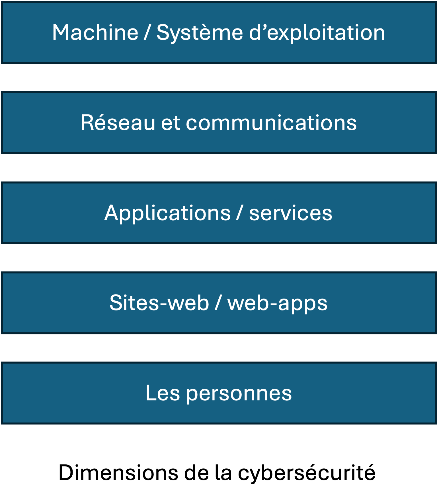

# Ce cours

This course aims to give you a foundational overview of cybersecurity.

Its aim is to equip you with the technical expertise necessary to anticipate and secure your machines, communications, infrastructures.

This course focuses primarily on the **technical aspects** of security, over a number of levels :

