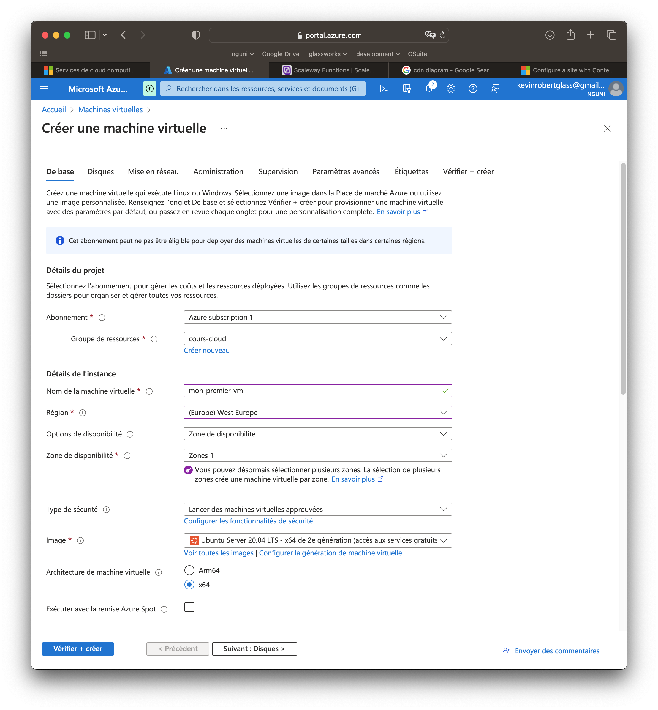
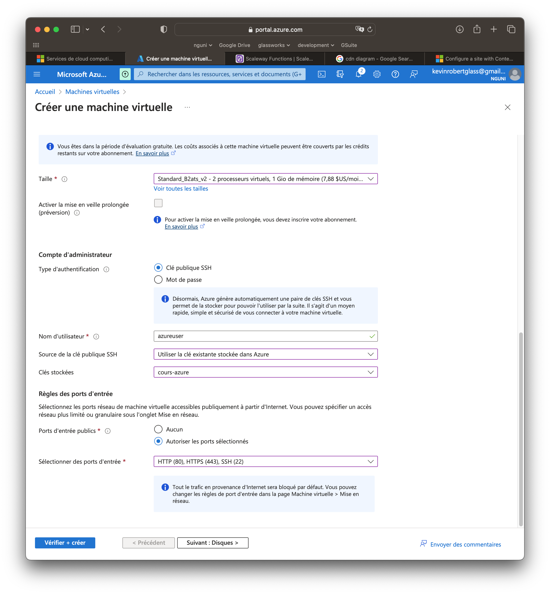
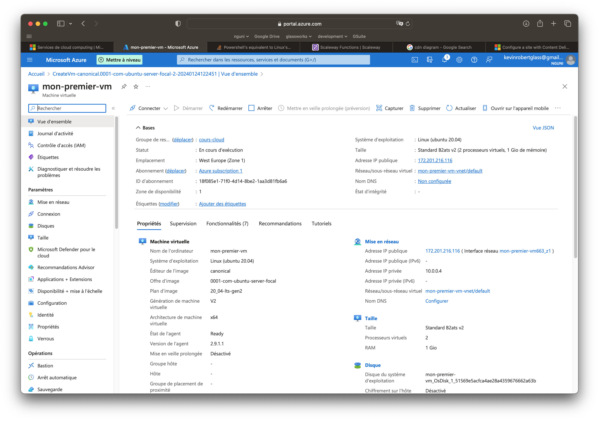

## Exercice

L’objectif est de simuler au maximum un déploiement réel.

Nous allons créer et configurer une instance cloud et déployer manuellement nos services dessus le longue dui cours (serveurs, SGBDR, docker, APIs, etc). Il faudrait donc savoir comment configurer une instance.

Déployez une instance chez votre fournisseur cloud préféré :
-  [Scaleway](https://www.scaleway.com/) - le moins cher, environ 15€ pour une VM pour un mois entier
-  [Azure](https://portal.azure.com) - 100€ de crédit offert
-  AWS
-  GCP

* Si pas déjà fait, créez votre compte. Rentrez vos coordonnées bancaires, et suivez les étapes pour valider votre compte 

* Provisionner une instance - choisissez la moins chère !!  
  * &#x20;:warning: Attention :warning: , chez Scaleway, utilisez l'instance type _**DEV1-S**_ qui est la moins chère
* Installez **Ubuntu** comme système d'exploitation !
* Connectez-vous à votre instance avec `ssh` :

```bash
# Scaleway (Ubuntu)
ssh root@<adresse IP>

ou

# OVH
ssh debian@<adresse IP>
#  Azure
ssh azureuser@<adresse IP>

## ATTENTION ! Si vous avez une autre paire de clés qui n'est pas à /home/[UTILISATEUR]/.ssh :
ssh -i [chemin vers la clé privée] root@<adresse IP>
```

* [Créez un compte utilisateur](../050-droits/qui.md) autre que `root`. C’est conseillé pour une meilleure sécurité ainsi que pour vous protéger contre des bêtises !

```bash
adduser <nom d’utilisateur>
```

* Si cet utilisateur aura le droit d’installer ou lancer les commandes _administratives_, [ajoutez le au groupe](../050-droits/qui.md) _sudo_

```bash
usermod -aG sudo <nom d’utilisateur>
```

* Quittez votre shell `ssh` (sous l'utilisateur `root`), et reconnectez-vous en tant que l'utilisateur dont vous venez de créer.
* Accordez accès à votre voisin (et vice versa), en utilisant sa clé publique
* Révoquer l'accès de votre voisin



:warning: ATTENTION ! :warning:  N'oubliez pas _**d'éteindre votre instance**_ après les cours, sinon vous serait facturé pour le temps dont l'instance est active.

Si vous ne comptez plus utiliser l'instance et ses ressources, vous pouvez la supprimer aussi. Vérifiez que vous avez aussi supprimé les volumes associées ainsi que les adresses IP.

<mark style="color:red;">**Vous avez été prévenu !!**</mark>



## La procédure AZURE


Cliquer sur "Machine Virtuelles" et lancer le processus de création.

<figure><figcaption></figcaption></figure>

Dans le formulaire, préciser :

* Le même groupe de ressources que vous avez crée pour la clé ssh
* La même région
* Système d'exploitation: Ubuntu Server 20.04
* Architecture x64

<figure><figcaption></figcaption></figure>

Choisissons la puissance de la VM. Prenez l'option "Standard\_BTats\_V2 - 2 processeurs virtuels, 1 Go de mémoire" (le moins cher). Il se trouve qu'il faut cliquer sur "Toutes les tailles" et aller chercher le modèle.

Pour le compte administrateur, cochez l'option "Clé publique SSH".

Dans "Source de la clé publique SSH", sélectionnez "Utiliser la clé existante dans Azure".

Dans "Clés stockées" sélectionnez la clé qu'on a crée juste avant dans la liste.

Dans les ports d'entrée publics, sélectionnez HTTP, HTTPS et SSH.

Ensuite, cliquer sur "Suivant". Nous allons laisser les paramètres de base :

* un volume sera associé
* la mise en réseau de base sera effectué
* ...
* jusqu'au "Véfirier et créer"

Cliquer sur le bouton "Créer".

Attendez la création de votre VM, puis cliquez sur "Accéder à la ressource". Vous serez présenté avec un panneau de contrôle avec les détails sur votre VM.

<figure><figcaption></figcaption></figure>

Prenez note surtout de **l'adresse IP publique**.

