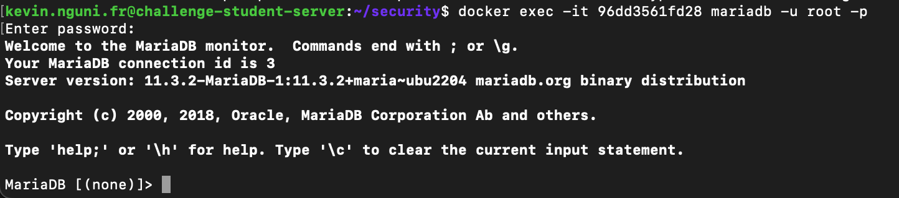

# SGBDR et Docker

Certaines applications doivent également être correctement configurées à des fins de sécurité.

Par exemple, votre base de données.

Dans cette section, nous allons déployer une base de données MariaDB sur notre serveur à l'aide de Docker. Nous verrons ensuite comment la sécuriser.


## Installer Docker sur votre Serveur

Nous faisons un déploiement de MariaDB avec Docker. Jusqu'au présent, nous avons installé Docker sur un PC type Desktop, en utilisant Docker Desktop. Vous trouverez [un guide d'installation ici](https://docs.glassworks.tech/unix-shell/introduction/010-introduction/installation-party).

Pour installer docker sur une instance Linux, il y aura quelques démarches à faire. Vous pouvez consulter la documentation officielle ici : [https://docs.docker.com/engine/install/](https://docs.docker.com/engine/install/)

Par exemple, sur Ubuntu, les étapes sont les suivantes (attention, à faire avec **sudo** ou en tant que **root**) :


```bash
# Désinstaller les anciennes versions de docker
sudo apt-get remove docker docker-engine docker.io containerd runc

# Mettre à jour les indexes des packages
sudo apt-get update

# Installer les packages tiers nécessaires pour ajouter Docker parmi nos indexes
sudo apt-get install \
    ca-certificates \
    curl \
    gnupg \
    lsb-release
    
# Télécharger la clé publique de Docker qui va vérifier l'authenticité
sudo mkdir -p /etc/apt/keyrings
curl -fsSL https://download.docker.com/linux/ubuntu/gpg | sudo gpg --dearmor -o /etc/apt/keyrings/docker.gpg

# Installer le dépot Docker parmi les sources connues de notre distribution
echo \
  "deb [arch=$(dpkg --print-architecture) signed-by=/etc/apt/keyrings/docker.gpg] https://download.docker.com/linux/ubuntu \
  $(lsb_release -cs) stable" | sudo tee /etc/apt/sources.list.d/docker.list > /dev/null
sudo chmod a+r /etc/apt/keyrings/docker.gpg
    
# Remettre à jour nos indexes
sudo apt-get update

# Installer Docker 
sudo apt-get install docker-ce docker-ce-cli containerd.io docker-compose-plugin
```

Une fois installé, vous pouvez vérifier que le processus fonctionne correctement avec :

```bash
systemctl status docker
```

### Accorder accès au groupe Docker

Certains de vos utilisateurs Linux auront le droit à contrôler les processus Docker, sans passer par `sudo`.

Pour leur donner ce droit, ajoutez les utilisateurs concernés au groupe `docker` :


```bash
usermod -aG docker [nom d'utilisateur]
```


Attention !

Seulement les utilisateurs privilégiés devront posséder ce droit.



## docker-compose.yml

Nous allons créer un sous-répertoire sur notre volume crypté pour stocker les données de notre SGBDR : 

```bash
mkdir /mnt/encrypteddata/data
```

Nous sommes prêts maintenant à rédiger une `docker-compose.yml` pour production.

Nous allons créer des variables d'environnement dans notre shell (qui persisteront uniquement la durée de notre SHELL), qui contiennent les coordonnées de l'utilisateur `root`  de notre SGBDR :


```bash
export MYSQL_ROOT_PASSWORD=abcd1234
export MYSQL_DATABASE=mydbprod
```


C'est la bonne façon de traiter les données sensibles telles que les mots de passe. Nous ne voulons certainement pas les stocker dans un fichier qui pourrait être accidentellement livré à GIT, et nous ne voulons pas non plus les écrire dans le terminal, car ils pourraient être visibles dans notre historique.



Dans le `docker-compose.yml`, nous utilisons ces variables avec `${ NOM_DE_VARIABLE }`.



```yaml
version: '3.9'

services:
  mon_sgbdr:
    image: mariadb
    restart: always
    # variables d'environnement à créer dans le container
    environment:      
      - MYSQL_ALLOW_EMPTY_PASSWORD=false
      - MYSQL_ROOT_PASSWORD=${MYSQL_ROOT_PASSWORD}
      - MYSQL_DATABASE=${MYSQL_DATABASE}
    # options de lancement (encodage)
    command: [
      "--character-set-server=utf8mb4",
      "--collation-server=utf8mb4_unicode_ci",
    ]
    volumes:
      # stocker les données sur le volume cryptée : /mnt/encrypteddata/data
      - /mnt/encrypteddata/data:/var/lib/mysql
    networks:
      # Ce service existera sur le réseau virtuel suivant
      - sgbdr-network-prod
      
networks:
  sgbdr-network-prod:
    driver: bridge
    name: sgbdr-network-prod
```


On lance notre DB avec :

```bash
docker compose up -d
```


## Connexion via le terminal

Par défaut, toutes les installations de MariaDB viennent avec un client qui s'appelle **mariadb**. Ce client permet d'ouvrir un interprète et envoyer de commandes au SGBDR.

Nous pouvons, sans rien installer, établir une connexion au SGBDR en ouvrant un shell interactif au Container, et en lançant la commande :

D'abord, identifiez bien le ID de votre Container Mariadb :

```bash
docker container ls
```

Une fois repéré l'ID du container (dans mon exemple, le ID est `794b579cd610`) :

```bash
docker exec -it 794b579cd610 mariadb -u root -p
```

<figure><figcaption></figcaption></figure>

Vous pouvez executer du SQL en tant que `root` :

```sql
create database sakila;
show databases;
```


## Importer des données

Vous pouvez importer des données via le terminal aussi.

Installez d'abord un outil qui permet de télécharger des fichiers distants :

```bash
sudo apt install wget
```

Téléchargez les sauvegardes d'une base de données :

```bash
wget https://dev.glassworks.tech:18081/courses/sgbdr/sgbdr-supports/-/raw/main/src/samples/sakila/sakila-schema.sql
wget https://dev.glassworks.tech:18081/courses/sgbdr/sgbdr-supports/-/raw/main/src/samples/sakila/sakila-data.sql
```

Importez des données :


```bash
# Importer le schéma
docker exec -i 794b579cd610 mariadb -u root -p$MYSQL_ROOT_PASSWORD sakila < ./sakila-schema.sql

# Importer les données
docker exec -i 794b579cd610 mariadb -u root -p$MYSQL_ROOT_PASSWORD sakila < ./sakila-data.sql
```

N'oubliez pas de préciser la variable d'environnement `MYSQL_ROOT_PASSWORD` si vous avez ouvert un nouveau terminal !

Reconnectez-vous à votre base de données. Vous devriez voir vos données à l'intérieur.

## Connexion de votre machine locale

Disponible à [https://tableplus.com](https://tableplus.com) pour MacOS et Windows.

<figure><figcaption></figcaption></figure>

<figure><figcaption></figcaption></figure>

Vos coordonnées de connexion devront être :

* _Nom d'hôte_ : `l'adresse IP de votre serveur`
* _Port_ : 3600
* _Nom d'utilisateur_ : `root`
* _Mot de passe_ : `votre motre de passe root`

Essayez d'établir une connexion. Cela fonctionne comme attendu ? Pourquoi ?

## Exposer le port docker

Votre connexion n'a pas fonctionné car Docker n'expose pas automatiquement les ports des processus qu'il exécute au monde extérieur.

Cela peut être un moyen très pratique de sécuriser vos applications du monde extérieur ! Nous discuterons du **port scanning* dans un chapitre ultérieur.

Pour un SGBDR cependant, nous voulons pouvoir nous connecter depuis le monde extérieur pour pouvoir effectuer des tâches administratives, nous sommes donc obligés d'exposer un port.
Modifiez votre `docker-compose.yml` et ajoutez l'entrée `ports` :


```yaml
version: '3.9'

services:
  mon_sgbdr:
    image: mariadb
    restart: always
    # port-externe (hôte) : port-interne (container)
    ports:
      - "7100:3306"    
    # variables d'environnement à créer dans le container
    environment:      
      - MYSQL_ALLOW_EMPTY_PASSWORD=false
      - MYSQL_ROOT_PASSWORD=${MYSQL_ROOT_PASSWORD}
      - MYSQL_DATABASE=${MYSQL_DATABASE}
    # options de lancement (encodage)
    command: [
      "--character-set-server=utf8mb4",
      "--collation-server=utf8mb4_unicode_ci",
    ]
    volumes:
      # stocker les données sur le volume cryptée : /mnt/encrypteddata/data
      - /mnt/encrypteddata/data:/var/lib/mysql
    networks:
      # Ce service existera sur le réseau virtuel suivant
      - sgbdr-network-prod
      
networks:
  sgbdr-network-prod:
    driver: bridge
    name: sgbdr-network-prod
```


Notez que, par défaut, les applications SGBDR telles que MySQL et MariaDB écoutent sur le port 3306. 

Ici, nous exposons le port 7100, un port qui n'est pas typiquement associé à MySQL. Cela signifie qu'un port-scanner peut ne pas trouver le service, ou ne pas savoir immédiatement quels sont les vecteurs d'attaque disponibles.

Redémarrez votre service :


```bash
docker compose down
docker compose up -d
```

La liste de vos conteneurs révèlera que votre port est maintenant exposé :

```bash
docker ps

# e9f05406c881   mariadb "docker-entrypoint.s…"   3 seconds ago   Up 2 seconds   0.0.0.0:7100->3306/tcp, :::7100->3306/tcp     security-mon_sgbdr-1
```

Réessayez de vous connecter à TablePlus, en spécifiant cette fois le port 7100. Vous pouvez vous connecter !