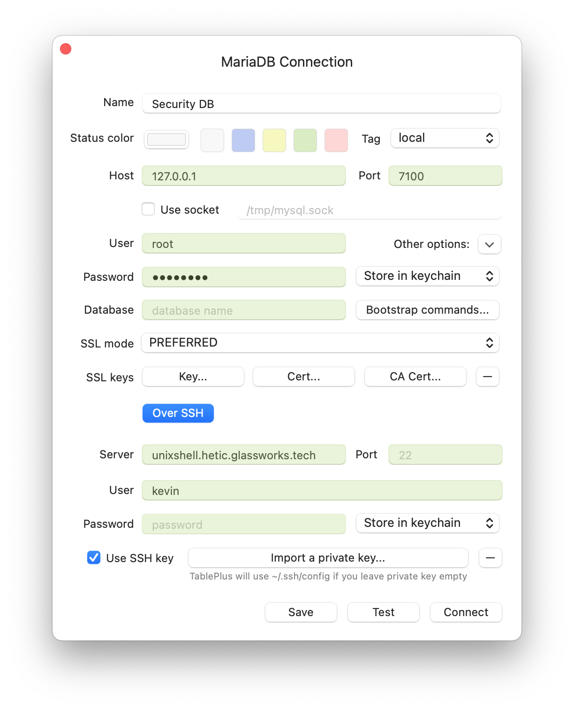

# Tunnel SSH

Actuellement, toute communication avec notre SGBDR sera non crypté. 

Idéalement, nous souhaitons que toutes les communications administratives de TablePlus soient cryptées. Nous pouvons le faire en utilisant SSH :



Notez que le `Host` change en `127.0.0.1`, puisque c'est l'adresse du SGBDR une fois que la connexion SSH est créée. Dans la partie SSH de la configuration, nous fournissons notre fichier de clé privée qui nous donne accès à notre serveur

## Obliger une connexion sécurisée

Pour l'instant, il est possible de se connecter à la base de données avec ou sans SSH. Des accidents peuvent survenir, et nous pouvons nous connecter accidentellement via une connexion non sécurisée.
.

Idéalement, [on sécurise des communications avec TLS](https://mariadb.com/docs/server/security/data-in-transit-encryption/enterprise-server/enable-tls/). C'est l'équivalent de la connexion SSL qu'on voit dans les navigateurs. Non seulement on établit des connexions cryptées, mais aussi, on établit un niveau de confiance auprès de notre base de données.

En revanche, créer des certificats exige un nom de domaine, qu'on n'a pas encore. Je vous encourage quand même à suivre le guide marque dessus.

Pour ce cours, nous nous contenterons à **obliger des connexions via SSH exclusivement**. C'est-à-dire, nous devons d'abord établir un tunnel SSH vers l'instance hôte, et ensuite envoyer des commandes via ce tunnel crypté.

Ceci est facile avec Docker ! Nous modifions notre `docker-compose.yml`, en ajoutant `127.0.0.1` devant le port qu'on a ouvert :


```yml

version: '3.9'

services:
  mon_sgbdr:
    image: mariadb
    restart: always
    # port-externe (hôte) : port-interne (container)
    ports:
      - "127.0.0.1:7100:3306"    
    ...
```

En ajoutant `127.0.0.1`, nous signalons à Docker qu'il faut accepter uniquement les connexions provenant de l'hôte même, et pas du monde extérieur. 

Essayer : modifiez vous-même votre `docker-compose.yml`, redémarrez votre service, et essayez de vous connecter via votre client local.

La seule façon d'établir une connexion du monde extérieur est d’établir d'abord une connexion SSH à l'instance. Dans votre client, vous auriez l'option de configurer la connexion SSH et fournir la clé privée nécessaire pour la connexion.




**Connexions par SSH**

Cette stratégie implique que même vos APIs doivent se connecter via SSH, qui n'est pas forcément voulu, surtout s'ils existent sur le réseau local. À ce moment-là, on n'ouvre pas de port du tout (on enlève la partie `ports` du `docker-compose.yml`). Seulement les services qui existent sans le réseau docker auront accès (mais en non sécurisé).

Sinon, on peut aussi créer des tunnels SSH dans nos APIs, si nécessaire avec des librairies tierces (ex. [ssh2 pour nodejs](https://github.com/mscdex/ssh2)). En revanche, nous créons une dépendance sur une tech basée sur l'architecture de prod qui n'est pas idéal.

Enfin, il sera peut-être prudent de suivre les démarches de mise en place des certificats TLS. Cette solution est effectivement plus souple dans le long terme.




