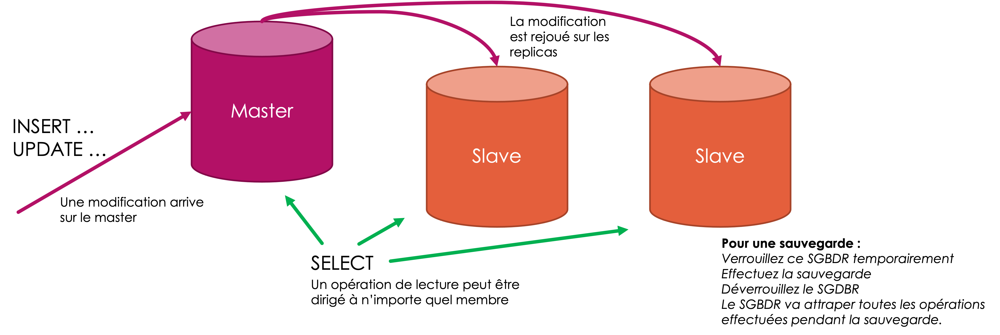

# Sauvegardes

Un système en service est assujetti à une gamme de risques divers. Avant de développer une stratégie de sauvegarde, il faut comprendre les risques, pour pouvoir assurer qu’on les a tous traité.

- Panne de matériel 
- Problème fournisseur : exemple, l’incendie chez OVH en 2021
- Modification ou suppression malicieuse (hack)
- Piratage et rançon
- Erreurs humaines : un utilisateur « autorisé » modifie ou supprime des données par erreur
- … autres ?

Prenons un exemple (tiré d'une expérience réelle) : 

> Dans mon entreprise, une sauvegarde automatique se fait tous les soirs, sur un disque dur attaché au serveur.

- Panne de matériel 
  - Protégé !
- Problème fournisseur : exemple, l’incendie chez OVH en 2021  : 
  - **Pas protégé !**
- Modification ou suppression malicieuse (hack)
  - Ça dépend le niveau d’accès du hacker, s’il a accès au disque de sauvegarde, pas protégé !
- Piratage et rançon
  - Idem
- Erreurs humaines : un utilisateur « autorisé » modifie ou supprime des données par erreur
  - **Pas protégé**, si on ne garde pas une historique de sauvegardes

Notre stratégie de sauvegarde n'est donc pas suffisante !

## Critères d'une sauvegarde

La liste suivante est une sorte de checklist que j'utilise pour évaluer si ma stratégie de sauvegarde est suffisant :

- Atomique :
  - Le risque est qu’une donnée change pendent la sauvegarde, mettant en péril l’intégrité de la base.
  - Solutions ? 
    - verrouiller les tables pour refuser de l’accès en écriture … mais votre service devient indisponible pendant la sauvegarde
- Intégralité :
  - Est-ce que TOUTES les informations nécessaires sont exportées ?
    - Les données ?
    - Utilisateurs et leurs droits  ?
    - Procédures, triggers, index ?
- Performant :
  - Il ne faut pas qu’une sauvegarde basse la performance de votre service 
- Stockage redondant et « off-site » :
  - La sauvegarde est stockée dans une data-center autre que le serveur de production ? 
  - Est-ce que vous avez plusieurs copies des sauvegardes ? 
  - N’oubliez pas qu’un disque dur de sauvegarde peut échouer aussi !
- Stockage d’une historique :
  - Garder plusieurs versions de vos sauvegardes pour pouvoir analyser les évolutions et récupérer les données perdues
- Stockage sécurisé : 
  - attention à l’accès aux fichiers de sauvegarde. Est-ce que la sauvegarde est cryptée ?
- Prouvée :
  - Est-ce que vous avez automatisé et testé un rétablissement ? Souvent on découvre que nos sauvegardes ne sont pas suffisantes seulement après une sinistre.

## Sauvegardes avec MariaDB / MysQL

Chaque SGBDR dispose de ses propres moyens de sauvegarde, y compris MairaDB :
- `mysqldump` 
- `mariabackup`

### `mysqldump`

L'outil `mysqldump` est installé avec MariaDB ou MySQL, et donc se trouve dans le container (comme la commande `mysql`).

La documentation : [https://mariadb.com/kb/en/mariadb-dumpmysqldump/](https://mariadb.com/kb/en/mariadb-dumpmysqldump/)

C'est une solution simple pour les petites bases de données. L'outil export le DDL et le DML nécessaire pour reconstruire le même schéma et données dans un nouveau SGBDR.

En revanche, attention aux éléments non exportés :

- Les utilisateurs et leurs droits ne sont pas exportés
- Les procédures stockées ne sont pas exportées

Du coup, un simple `mysqldump` ne sera pas suffisant pour remettre en opération votre SGDBR si vous utilisez des procédures, ou vous avez différents niveaux d'accès pour vos utilisateurs.

Attention : par défaut `mysqldump`  ne verrouille pas les tables pendant l'export. Donc n'importe quel écriture durant l'export pourrait rendre la sauvegarde incohérente.

On peut activer l’option de verrouiller les tables avec le paramètre `--lock-tables`. Mais, durant la sauvegarde, votre plateforme n'autorisera pas des écritures, et ceci est probablement pas acceptable !

### `mariabackup`

Au lieu d'exporter un DDL et DML, `mariabackup` est une solution qui sauvegarde plutôt les données brutes du disque dur. Cela veut dire que les utilisateurs, procédures, etc sont pris en compte par la sauvegarde.

En plus, `mariabackup` permet une sauvegarde entière ou par incrément. 

En revanche, la sauvegarde ne fonctionnera que pour MariaDB, et seulement avec la même version de MariaDB. Ceci est une contrainte peu importante, surtout pour la remise en route rapide après un sinistre.

Pour plus d'information sur `mariabackup` [https://mariadb.com/kb/en/full-backup-and-restore-with-mariabackup/](https://mariadb.com/kb/en/full-backup-and-restore-with-mariabackup/)

## Réplication

Avec l'émergence des solutions cloud, et les audiences massives, la *réplication* des données devient un sujet de plus en plus supporté par les SGBDR.

En bref, la réplication permet de dupliquer le SGBDR (et ses données) sur plusieurs machines physiques. Toutes les instructions d’écriture sont exécutées sur le *master* et les modifications sont apportées sur les autres instances (avec un petit délai). Il y a plusieurs avantages :

- Des opérations de lecture peuvent être faites sur n'importe quel participant du set de réplication, et donc allège la charge sur le *master*
- Si un participant du set de réplication disparait (y compris le *master*), il reste d'autres membres qui garantissent la continuité du service
- Pour faire une sauvegarde, on peut verrouiller entièrement un membre (non master), et effectuer la sauvegarde tranquillement. Pendant ce temps, les autres membres peuvent continuer leurs opérations. 

<figure><figcaption></figcaption></figure>
