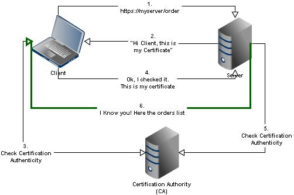
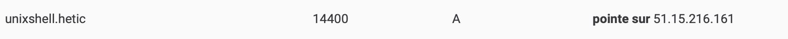

# SSL et Reverse Proxy

Toutes les communications doivent être sécurisées sur votre infrastructure. Jusqu'à présent, vous avez appris à renforcer les tunnels SSH vers votre VM, mais nous ne pouvons pas le faire pour un utilisateur inconnu qui souhaite accéder à notre site web.

Nous ne pouvons pas, par exemple, obtenir sa clé publique avant qu'il ne crée une connexion, car il est inconnu !

En outre, l'utilisateur peut avoir des doutes sur NOTRE identité. Peut-être que mon nom de domaine est `bnpbaribas.fr`, qui est très proche de celui d'une banque existante, mais légèrement différent. 

Si je duplique mon site web pour qu'il ressemble exactement à celui de la banque, je pourrai tromper l'utilisateur et lui faire divulguer ses codes d'accès.

Une fois de plus, nous utilisons la cryptographie asymétrique non seulement pour sécuriser les communications, mais aussi pour garantir la confiance, à l'aide de certificats !



## Service qui écoute sur le Web

Nous allons déployer un petit serveur qui envoie un message "Hello World" avec Docker :


```yaml
version: '3.9'

services:
  helloworld:
    image: crccheck/hello-world
    restart: always
    ports:
      - "8080:8000"
```


Lancez le service avec 

```bash
docker compose up -d
```

... et testez dans votre navigateur à l'adresse suivant : `http://[votre adresse IP]:8080`. Vous devriez voir le suivant dans votre navigateur :



N'oubliez pas d'ouvrir le port 8080 dans votre service cloud, si nécessaire.



## Nom de domaine

Nous dépendons d'autorités de certification, des acteurs tiers, qui vérifient notre identité.

Le fait d'être en possession d'un nom de domaine et d'en prouver la possession suffit pour qu'une tierce partie vérifie notre identité.

Comment le prouver ?

- En tant que propriétaire d'un domaine, je suis le seul à pouvoir le faire pointer vers un serveur spécifique.
- configurer le domaine pour qu'il pointe vers un serveur
- en tant qu'administrateur du serveur, je peux le configurer pour qu'il réponde aux appels provenant de ce domaine
- la tierce partie teste que le domaine pointe vers le serveur configuré, et si une requête est correctement traitée, elle délivre le certificat.

Si vous ne l'avez pas encore fait, reserver un nom de domaine. Le prix n'est pas cher, et pas plus que 10€ par an pour un nom de domaine `.fr` :

- [Gandi](https://www.gandi.net)
- [Scaleway](https://www.scaleway.com/en/domains-and-dns/)
- [OVH](https://www.ovhcloud.com/fr/domains)
- ...

## Zone DNS

Créez un enregistrement A qui pointe vers votre serveur :



You can use whatever prefix you want. If your domain is `babacool.fr`, you can create a host called `hello.babacool.fr` :

```
hello        A       52.190.10.20
```


## Configurer votre proxy

Dans la section précédente, nous avons installé nginx. Configurons nginx pour qu'il utilise un certificat SSL.

Tout d'abord, créez un fichier qui indique à nginx l'existence de votre sous-domaine. Toutes les requêtes entrantes sur ce sous-domaine seront traitées par la configuration.

```bash
nano /etc/nginx/sites-available/hello.babacool.fr.conf
```

Dans le fichier de configuration, précisez l'existence de votre serveur qui écoute sur le port 80, et qui renvoie des requêtes à notre serveur docker sur le port 8080 :

```conf
server {
    listen 80;
    server_name hello.babacool.fr;   

    location / {
       proxy_pass http://127.0.0.1:8080;
    }
}
```

Pour **activer** ce site il faudrait établir un lien symbolique dans `/etc/nginx/sites-enabled` :

```bash
cd /etc/nginx/sites-enabled
ln -s /etc/nginx/sites-available/hello.babacool.fr.conf
```

Rechargez nginx :

```bash
systemctl reload nginx

# ou
service nginx reload
```

Testez dans votre navigateur, cette fois-ci sans le port : `http://hello.babacool.fr`. Vous devriez voir le même message.


N'oubliez pas d'ouvrir le port 80 dans votre service cloud, si nécessaire, care maintenant on fait un appel en http, qui utilise par défaut le port 80.



## Certbot

Installez et configurez [Certbot via ces instructions](https://certbot.eff.org/instructions?ws=nginx&os=ubuntufocal).

Laissez certbot reconfigurer votre configuration nginx pour utiliser les certificats.

Testez dans votre navigateur, cette fois-ci sans le port : `https://hello.babacool.fr`. Vous devriez voir le même message !

Vos communications sont désormais sécurisés ! Allez consulter la configuration nginx pour voir les modifications faites par CertBot.

Les certificats se trouvent à l'endroit suivant :

```
/etc/letsencrypt/live
```


